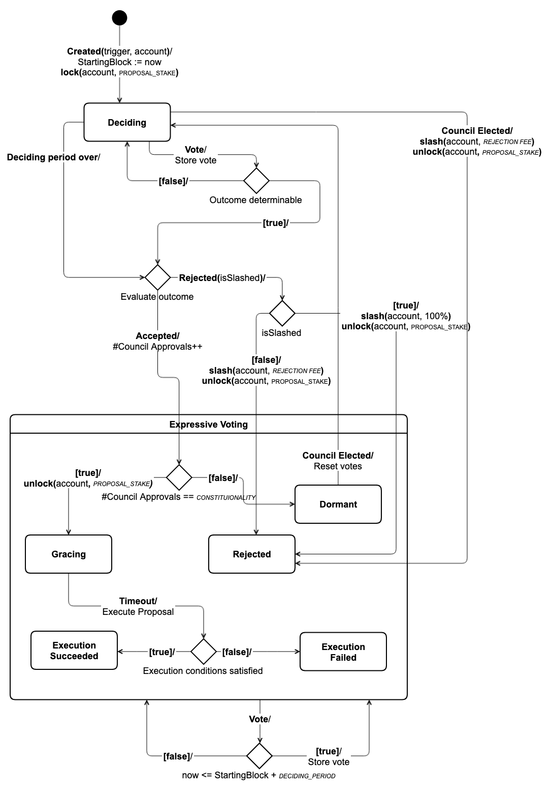

# Proposals

## Introduction

A proposal is a motion to change the state or policy of the system in some way. There are a wide variety of such proposal types, each type having a different

* set of required input parameter values
* requirements and risks of proposing
* barrier for getting accepted
* delay to being put into motion when accepted

The reason for this differentiation across types is because different proposals have very different effects, and carry very different risks of failure or abuse. The proposal system has the responsibility of coordinating the different actors involved in the lifetime of a proposal, from submission to finalization.

## Roles

The relevant roles in the proposal system are

* **Proposer:** A member that has submitted an instance of a specific proposal type. A given member can submit multiple proposals at once, or over time.
* **Council Members:** They are tasked with voting on proposals, which determines whether the proposals are accepted or not, as well as discussing a proposal with the proposer, and leaving a rationale for their vote.

## Concepts

### Vote

Each council member can submit at most one vote per proposal, and it includes the following:

* **Rationale:** A human readable description of why they are voting as they are.
* **Type:** There three types
  * **Approve:** Proposal should be approved.
  * **Reject:** Proposal should be rejected. Additionally, it can be expressed whether it should be slashed as part of the rejection.
  * **Abstain:** Voter has no position on outcome.

### Proposal Type

A proposal type is a parametrized intention to have some effect on the platform. The set of proposal types will increase considerably in the future, and the current types are listed below.

#### Constants

All proposal types have constant values for a shared set of parameters that are common across all types, thee are called _proposal constants._ The name and semantics of each constant is listed in the table below.

<table>
  <thead>
    <tr>
      <th style="text-align:left"><b>Name</b>
      </th>
      <th style="text-align:left">Description</th>
    </tr>
  </thead>
  <tbody>
    <tr>
      <td style="text-align:left"><code>DECIDING_PERIOD</code>
      </td>
      <td style="text-align:left">
        
Maximum number of blocks for deciding period.

        
Integer no less than 1.

      </td>
    </tr>
    <tr>
      <td style="text-align:left"><code>GRACING_LIMIT</code>
      </td>
      <td style="text-align:left">
        
Minimum number of blocks that must pass after a
           proposal is approved until it has its intended effect.

        
Integer no less than 0.

      </td>
    </tr>
    <tr>
      <td style="text-align:left"><code>APPROVAL_QUORUM</code>
      </td>
      <td style="text-align:left">
        
Number of votes cast below which the proposal cannot be approved.

        
Integer no less than 1.

      </td>
    </tr>
    <tr>
      <td style="text-align:left"><code>APPROVAL_THRESHOLD</code>
      </td>
      <td style="text-align:left">
        
Minimum percentage of approval votes as a share of
           all cast votes that result in approval.

        
Integer in [0, 100].

      </td>
    </tr>
    <tr>
      <td style="text-align:left"><code>SLASHING_QUORUM</code>
      </td>
      <td style="text-align:left">
        
Number of votes cast below which the proposal
           cannot be slashed.

        
Integer no less than 1.

      </td>
    </tr>
    <tr>
      <td style="text-align:left"><code>SLASHING_THRESHOLD</code>
      </td>
      <td style="text-align:left">
        
Minimum percentage of cast votes as share that slash relative
           to those that vote approve, abstain or reject.

        
Integer in [0, 100].

      </td>
    </tr>
    <tr>
      <td style="text-align:left"><code>STAKE</code>
      </td>
      <td style="text-align:left">
        
Exact stake required to create a proposal of this type.

        
Integer no less than 0.

      </td>
    </tr>
    <tr>
      <td style="text-align:left"><code>CONSTITUTIONALITY</code>
      </td>
      <td style="text-align:left">The number of councils in that must approve the proposal
         in a row before it has its intended effect.
         Integer no less than 1.</td>
    </tr>
  </tbody>
</table>

#### Parameters: General & Specific

Whenever a proposal of a given type is created, the proposer must provide values for a set of parameters. The parameters fall into one of two categories: _general_ and _type-specific_. Each parameter will also have some constraint on the valid range of values. The general proposal parameters are

* **Proposer:** Member identifier of the proposer.
* **Title:** A human readable title.
* **Rationale:** A human readable description text that is intended to hold the rationale for the proposal should be accepted. It is expected that some social convention will emerge on the appropriate encoding of this text, for example markdown, that would facilitate consistent input and display across client applications.
* **Trigger:** An optional block number where the proposal is to be executed.
* **Staking Account:** The account that holds the funds that will be locked for staking, if required.

The type-specific parameters for each proposal type are listed with the proposals below.

#### Creation Conditions

When a proposal is submitted, a set of conditions on the values of the input parameters \(only\) are evaluated, these are called _creation conditions_, and creating the proposal fails if they are not satisfied. These are things like for example respecting the upper bound on the amount of money you are asking for in a spending proposal. Importantly, these checks are _pure_, they only depend on parameters, not the state of the system.

#### Execution Conditions

A proposal may be approved, and at some point the actual business logic that embodies its intended effect has to be executed. This is always much later than when the proposal was first created, and it may very well be possible to have a proposal which originally looked would have had its intended effect to no longer be applicable because the state of he system has changed in the intermediate. An example could be that a funding proposal requires more money than the council currently can spend due to other spending that may have occurred since the proposal was approved. These conditions are called _execution conditions_, and importantly, they are not checked at any time prior to execution of this business logic.

### Proposal

A proposal is defined by the following information

* **Id:** A unique non-negative integer identifier.
* **Type:** Which type of proposal this is.
* **General Parameters:** Values for general proposal parameters.
* **Type-Specific Parameters:** Values for type-specific proposal parameters.
* **Stage:**  The life-cycle stage of a proposal, as defined precisely in the next section.
* **Votes:** The set of votes currently associated with the proposal.
* **Council Approvals:** How many prior councils have approved the proposal, starts at 0.
* **Starting Block:** The block where the deciding period was initiated.
* **Discussion:** A single threaded discussion about the proposal, as defined in the discussion section.

**Stage**

Below is a list of the stages a proposal can be in, and what each of them mean:

* **Deciding:** Initial stage for all successfully created proposals. This is the only stage where votes submitted can actually impact the outcome. If a new council is elected, any present stake is slashed by `REJECTION_FEE` , the staking lock is removed and the proposal transitions to the rejected stage.  
  
  When a vote is submitted it is evaluated as such:    

  1. If `APPROVAL_QUORUM` and `APPROVAL_THRESHOLD` are satisfied, then increment council approvals counter. If counter now is `CONSTITUTIONALITY` then remove staking lock and transition to gracing stage, otherwise  transition to dormant stage.
  2. If `SLASHING_QUORUM` and `SLASHING_THRESHOLD` are satisfied, but point \(1\) is not, then slash full stake, remove the lock and transition to the rejected stage.
  3. If points \(1\) and \(2\) are not and cannot be satisifed by any future a outstanding votes, then slash stake by up to `REJECTION_FEE`, remove lock and transition to rejected stage.

  If `DECIDING_PERIOD` blocks pass while still in this stage, apply checks \(1-3\) with same transition and side-effect rules as above.  

* **Dormant:** Was approved by current council, but requires further approvals to satisfy `CONSTITUTIONALITY` requirement. Transitions to deciding stage when next council is elected.
* **Gracing:** Is awaiting execution for until trigger block, or `GRACING_LIMIT` blocks since start of period if no trigger was provided. When this duration is over, the execution conditions are checked, if they are satisfied the proposal transitions to the execution succeeded stage, if they are not, it transitions to the execution failed stage.
* **Vetoed:** Was halted by SUDO, nothing further can happen. This is removed at mainnet.
* **Slashed:** Was rejected with full stake penalty by the current council.
* **Execution Succeeded:** Execution succeeded, nothing further can happen.
* **Execution Failed:** Execution failed due to unsatisfied execution conditions, nothing further can happen.
* **Rejected:** Was not approved, nothing further can happen.

It useful to designate any proposal in the stages deciding, dormant or gracing, as an _active proposal_, and any other proposal is said to be an _inactive proposal._

Two extra transition rules are worth bearing in mind

* A proposal could be transitted to **Gracing**, **Slashed** or **Rejected** states before the ending of the `DECIDING_PERIOD` when votes number is enough to satisfy quorum or threshold parameters. Votes can not be submitted after that.
* For any active proposal, SUDO can initiate veto, which results in transition to vetoed stage.

The stages and transitions, excluding SUDO dynamics, are summarized in the image below.

### Discussion

A single threaded discussion is opened for each successfully created discussion. A thread can be in two modes, open or closed. In open mode, any member can post a message, while in closed mode, only the active council, the original proposer, or one among a set of whitelisted members can post. Mode can be changed by member or council member at any time, and default mode is open. Both council members and proposer can curate whitelist by adding and removing members. A poster can edit a post an unlimited number of times, but only if they have access. A thread can no longer be updated in any way \(mode, posting, edits, etc.\) when `DISCUSSION_LINGERING_DURATION` have passed since being rejected or executed. Lastly, at most `MAX_POSTS_PER_THREAD` can be posted in a single thread.

### Staking

As described, proposals may require staking to be submitted. A single account must be used to provide the stake for a proposal, and it cannot be used to hold stake for any other proposals or purpose, except voting, at the same time. The staking is implemented as a lock with id `PROPOSAL_LOCK_ID`. 

## General Proposals

This section includes proposals that concern the platform as whole in terms intended effect and type-specific parameters.

### Signal

#### Parameters

| Name | Description |
| :--- | :--- |
| `signal` | The actual human readable signaling text. |

Note that the distinction between `signal` and the rationale parameter is that the rationale is the _why_ and this is the _what._

#### Constants

| Constant | Value |
| :--- | :--- |
| `DECIDING_PERIOD` | `fill-in` |
| `GRACE_PERIOD` | `fill-in` |
| `APPROVAL_QUORUM` | `fill-in` |
| `APPROVAL_THRESHOLD` | `fill-in` |
| `SLASHING_QUORUM` | `fill-in` |
| `SLASHING_THRESHOLD` | `fill-in` |
| `PROPOSAL_STAKE` | `fill-in` |
| `CONSTITUTIONALITY` | `fill-in` |

#### Creation Conditions

* `signal` is not empty.

#### Execution Conditions

None.

#### Effect

There is no direct effect of this proposal, its utility is purely for social coordination of matters outside of the direct state of the blockchain state.

### Runtime Upgrade

#### Parameters

| Name | Description |
| :--- | :--- |
| `blob` | The raw WebAssembly object to be used as the new runtime. |

#### Constants

| Constant | Value |
| :--- | :--- |
| `DECIDING_PERIOD` | `fill-in` |
| `GRACE_PERIOD` | `fill-in` |
| `APPROVAL_QUORUM` | `fill-in` |
| `APPROVAL_THRESHOLD` | `fill-in` |
| `SLASHING_QUORUM` | `fill-in` |
| `SLASHING_THRESHOLD` | `fill-in` |
| `PROPOSAL_STAKE` | `fill-in` |
| `CONSTITUTIONALITY` | `fill-in` |

#### Creation Conditions

* `blob` is non-empty.
* `blob` is no longer than `MAX_RUNTIME_UPGRADE_BYTES`

#### Execution Conditions

None.

#### Effect

The block after this proposal is executed will follow the rules of the runtime captured in the provided Wasm blob.

### Funding Requests

#### Parameters

| Name | Description |
| :--- | :--- |
| `amount` | The amount of tokens requested. |
| `account` | Recipient of funds. |

#### Constants

| Constant | Value |
| :--- | :--- |
| `DECIDING_PERIOD` | `fill-in` |
| `GRACE_PERIOD` | `fill-in` |
| `APPROVAL_QUORUM` | `fill-in` |
| `APPROVAL_THRESHOLD` | `fill-in` |
| `SLASHING_QUORUM` | `fill-in` |
| `SLASHING_THRESHOLD` | `fill-in` |
| `PROPOSAL_STAKE` | `fill-in` |
| `CONSTITUTIONALITY` | `fill-in` |

#### Creation Conditions

* `amount` is greater than zero.
* `amount` is  no more than `MAX_SPENDING_PROPOSAL_VALUE`
* the council budget is no less than `amount`.

#### Execution Conditions

* Minting the `amount` is within the current budget constraint of the council.

#### Effect

The council mints `amount` tokens out of current budget and credits `amount`.

### Set Election Parameters

#### Parameters

| Name | Description |
| :--- | :--- |
|  |  |

#### Constants

| Constant | Value |
| :--- | :--- |
| `DECIDING_PERIOD` | `fill-in` |
| `GRACE_PERIOD` | `fill-in` |
| `APPROVAL_QUORUM` | `fill-in` |
| `APPROVAL_THRESHOLD` | `fill-in` |
| `SLASHING_QUORUM` | `fill-in` |
| `SLASHING_THRESHOLD` | `fill-in` |
| `PROPOSAL_STAKE` | `fill-in` |
| `CONSTITUTIONALITY` | `fill-in` |

#### Creation Conditions

_xxx_

#### Execution Conditions

_xxxx_

#### Effect

As the Council will see a significantly increased workload, there may be need to change the some of the Election cycle parameters. This proposal allows the Council to vote on expanding the Council seats, increase or decrease the length of the Voting process, or the minimum stakes required to participate. If this proposal is voted through, a change of these parameters will not be activated until the next election cycle, to avoid the current Council making changes benefitting themselves.

### Set Working Group Budget

#### Parameters

| Name | Description |
| :--- | :--- |
| new-budget| New working group budget amount.|
| working-group| Specifies the working group.|

#### Constants

| Constant | Value |
| :--- | :--- |
| `DECIDING_PERIOD` | `fill-in` |
| `GRACE_PERIOD` | `fill-in` |
| `APPROVAL_QUORUM` | `fill-in` |
| `APPROVAL_THRESHOLD` | `fill-in` |
| `SLASHING_QUORUM` | `fill-in` |
| `SLASHING_THRESHOLD` | `fill-in` |
| `PROPOSAL_STAKE` | `fill-in` |
| `CONSTITUTIONALITY` | `fill-in` |

#### Creation Conditions

_xxx_

#### Execution Conditions

_xxxx_

#### Effect

The Council could set, increase or decrease the working group budget using this proposal. The working group budget could be used to pay role rewards, to spend on any goals by the group leader.

### Add Working Group Leader Opening

#### Parameters

| Name | Description |
| :--- | :--- |
| Wasm blob | The raw Webassembly object to be used as the new runtime. |

#### Constants

| Constant | Value |
| :--- | :--- |
| `DECIDING_PERIOD` | `fill-in` |
| `GRACE_PERIOD` | `fill-in` |
| `APPROVAL_QUORUM` | `fill-in` |
| `APPROVAL_THRESHOLD` | `fill-in` |
| `SLASHING_QUORUM` | `fill-in` |
| `SLASHING_THRESHOLD` | `fill-in` |
| `PROPOSAL_STAKE` | `fill-in` |
| `CONSTITUTIONALITY` | `fill-in` |

#### Creation Conditions

_xxx_

#### Execution Conditions

_xxxx_

#### Effect

This proposal allows an opening for a Storage Lead to be created. When editing the "Opening schema", you must ensure your changes still returns a valid JSON schema. This determines what information is collected from candidates. Note that the reward specified is not binding, and is only determined when the Fill Working Group Leader Opening proposal is made \(and approved\).

### Begin Review Working Group Leader Application

#### Parameters

| Name | Description |
| :--- | :--- |
| Wasm blob | The raw WebAssembly object to be used as the new runtime. |

#### Constants

| Constant | Value |
| :--- | :--- |
| `DECIDING_PERIOD` | `fill-in` |
| `GRACE_PERIOD` | `fill-in` |
| `APPROVAL_QUORUM` | `fill-in` |
| `APPROVAL_THRESHOLD` | `fill-in` |
| `SLASHING_QUORUM` | `fill-in` |
| `SLASHING_THRESHOLD` | `fill-in` |
| `PROPOSAL_STAKE` | `fill-in` |
| `CONSTITUTIONALITY` | `fill-in` |

#### Creation Conditions

_xxx_

#### Execution Conditions

_xxxx_

#### Effect

This simply sets the opening for Storage Lead to the "in review" status, meaning no further applications can be accepted. It is required to move on to the `Fill Working Group Leader Opening` proposal.

### Fill Working Group Leader Opening

#### Parameters

| Name | Description |
| :--- | :--- |
| Wasm blob | The raw Webassembly object to be used as the new runtime. |

#### Constants

| Constant | Value |
| :--- | :--- |
| `DECIDING_PERIOD` | `fill-in` |
| `GRACE_PERIOD` | `fill-in` |
| `APPROVAL_QUORUM` | `fill-in` |
| `APPROVAL_THRESHOLD` | `fill-in` |
| `SLASHING_QUORUM` | `fill-in` |
| `SLASHING_THRESHOLD` | `fill-in` |
| `PROPOSAL_STAKE` | `fill-in` |
| `CONSTITUTIONALITY` | `fill-in` |

#### Creation Conditions

_xxx_

#### Execution Conditions

_xxxx_

#### Effect

If the Opening is in the "Review Stage", use this proposal to propose a specific Lead. The Council can now vote, and, if approved, this will be the new Lead.

Note that there can be multiple proposals of this type at the same time, so multiple candidates can be considered simultaneously. However, once one is approved, the others will fail.

### Set Working Group Mint Capacity

#### Parameters

| Name | Description |
| :--- | :--- |
| Wasm blob | The raw Webassembly object to be used as the new runtime. |

#### Constants

| Constant | Value |
| :--- | :--- |
| `DECIDING_PERIOD` | `fill-in` |
| `GRACE_PERIOD` | `fill-in` |
| `APPROVAL_QUORUM` | `fill-in` |
| `APPROVAL_THRESHOLD` | `fill-in` |
| `SLASHING_QUORUM` | `fill-in` |
| `SLASHING_THRESHOLD` | `fill-in` |
| `PROPOSAL_STAKE` | `fill-in` |
| `CONSTITUTIONALITY` | `fill-in` |

#### Creation Conditions

_xxx_

#### Execution Conditions

_xxxx_

#### Effect

This effectively acts as a budget for the working group \(currently referring to the Storage Working Group\). The Storage Lead will be unable to spend more than the limit established by this proposal.

### Slash Working Group Leader Stake

#### Parameters

| Name | Description |
| :--- | :--- |
| Wasm blob | The raw Webassembly object to be used as the new runtime. |

#### Constants

| Constant | Value |
| :--- | :--- |
| `DECIDING_PERIOD` | `fill-in` |
| `GRACE_PERIOD` | `fill-in` |
| `APPROVAL_QUORUM` | `fill-in` |
| `APPROVAL_THRESHOLD` | `fill-in` |
| `SLASHING_QUORUM` | `fill-in` |
| `SLASHING_THRESHOLD` | `fill-in` |
| `PROPOSAL_STAKE` | `fill-in` |
| `CONSTITUTIONALITY` | `fill-in` |

#### Creation Conditions

_xxx_

#### Execution Conditions

_xxxx_

#### Effect

To punish or warn the Storage Lead for not performing their job correctly, they can be slashed partially or fully without firing them using this proposal type.

### Decrease Working Group Leader Stake

#### Parameters

| Name | Description |
| :--- | :--- |
| Wasm blob | The raw Webassembly object to be used as the new runtime. |

#### Constants

| Constant | Value |
| :--- | :--- |
| `DECIDING_PERIOD` | `fill-in` |
| `GRACE_PERIOD` | `fill-in` |
| `APPROVAL_QUORUM` | `fill-in` |
| `APPROVAL_THRESHOLD` | `fill-in` |
| `SLASHING_QUORUM` | `fill-in` |
| `SLASHING_THRESHOLD` | `fill-in` |
| `PROPOSAL_STAKE` | `fill-in` |
| `CONSTITUTIONALITY` | `fill-in` |

#### Creation Conditions

_xxx_

#### Execution Conditions

_xxxx_

#### Effect

This proposal type allows decreasing the stake of the Storage Lead.

### Set Working Group Leader Reward

#### Parameters

| Name | Description |
| :--- | :--- |
| Wasm blob | The raw Webassembly object to be used as the new runtime. |

#### Constants

| Constant | Value |
| :--- | :--- |
| `DECIDING_PERIOD` | `fill-in` |
| `GRACE_PERIOD` | `fill-in` |
| `APPROVAL_QUORUM` | `fill-in` |
| `APPROVAL_THRESHOLD` | `fill-in` |
| `SLASHING_QUORUM` | `fill-in` |
| `SLASHING_THRESHOLD` | `fill-in` |
| `PROPOSAL_STAKE` | `fill-in` |
| `CONSTITUTIONALITY` | `fill-in` |

#### Creation Conditions

_xxx_

#### Execution Conditions

_xxxx_

#### Effect

This proposal allows for changing the reward for the Storage Lead if it appears too little or too much. Note that only the amount can be changed, not the frequency.

### Terminate Working Group Leader Role

#### Parameters

| Name | Description |
| :--- | :--- |
| Wasm blob | The raw Webassembly object to be used as the new runtime. |

#### Constants

| Constant | Value |
| :--- | :--- |
| `DECIDING_PERIOD` | `fill-in` |
| `GRACE_PERIOD` | `fill-in` |
| `APPROVAL_QUORUM` | `fill-in` |
| `APPROVAL_THRESHOLD` | `fill-in` |
| `SLASHING_QUORUM` | `fill-in` |
| `SLASHING_THRESHOLD` | `fill-in` |
| `PROPOSAL_STAKE` | `fill-in` |
| `CONSTITUTIONALITY` | `fill-in` |

#### Creation Conditions

_xxx_

#### Execution Conditions

_xxxx_

#### Effect

If for whatever reason the Storage Lead needs to be removed from their post \(and potentially slashed\), this is the proposal type which needs to be voted on.

## Validation Proposals

### Set Max Validator Count

#### Parameters

| Name | Description |
| :--- | :--- |
| Wasm blob | The raw Webassembly object to be used as the new runtime. |

#### Constants

| Constant | Value |
| :--- | :--- |
| `DECIDING_PERIOD` | `fill-in` |
| `GRACE_PERIOD` | `fill-in` |
| `APPROVAL_QUORUM` | `fill-in` |
| `APPROVAL_THRESHOLD` | `fill-in` |
| `SLASHING_QUORUM` | `fill-in` |
| `SLASHING_THRESHOLD` | `fill-in` |
| `PROPOSAL_STAKE` | `fill-in` |
| `CONSTITUTIONALITY` | `fill-in` |

#### Creation Conditions

_xxx_

#### Execution Conditions

_xxxx_

#### Effect

The Validators are rewarded for producing blocks, and will share the rewards that are minted each era \(target 3600 blocks\). This reward is calculated based on the total issuance, and the amount of tJOY staked by the pool of Validators relative to the total issuance. A higher number means smaller rewards for each individual Validator, but set to low and the network grinds to a halt.

## Content Directory Proposals

### Set Content Curator Lead

#### Parameters

| Name | Description |
| :--- | :--- |
| Wasm blob | The raw Webassembly object to be used as the new runtime. |

#### Constants

| Constant | Value |
| :--- | :--- |
| `DECIDING_PERIOD` | `fill-in` |
| `GRACE_PERIOD` | `fill-in` |
| `APPROVAL_QUORUM` | `fill-in` |
| `APPROVAL_THRESHOLD` | `fill-in` |
| `SLASHING_QUORUM` | `fill-in` |
| `SLASHING_THRESHOLD` | `fill-in` |
| `PROPOSAL_STAKE` | `fill-in` |
| `CONSTITUTIONALITY` | `fill-in` |

#### Creation Conditions

_xxx_

#### Execution Conditions

_xxxx_

#### Effect

The Content Curator Lead is the first implementation of the concept of Group Leads on the platform. These will in general be responsible for hiring, firing, rewarding and training the group they are leading. They are hired by the council, and will be given a budget to perform their role satisfactory, without inflating the supply more than necessary.

This means they have to answer to the users if they fail in their task. In this particular case, all members can propose to:

* Set a Lead if there are none currently occupying the role
* Fire the existing Lead, without setting a new one
* Replace the existing Lead, with a specified new member

If the proposal is voted through, the change will occur immediately.

### Set Content Working Group Mint Capacity

#### Parameters

| Name | Description |
| :--- | :--- |
| Wasm blob | The raw Webassembly object to be used as the new runtime. |

#### Constants

| Constant | Value |
| :--- | :--- |
| `DECIDING_PERIOD` | `fill-in` |
| `GRACE_PERIOD` | `fill-in` |
| `APPROVAL_QUORUM` | `fill-in` |
| `APPROVAL_THRESHOLD` | `fill-in` |
| `SLASHING_QUORUM` | `fill-in` |
| `SLASHING_THRESHOLD` | `fill-in` |
| `PROPOSAL_STAKE` | `fill-in` |
| `CONSTITUTIONALITY` | `fill-in` |

#### Creation Conditions

_xxx_

#### Execution Conditions

_xxxx_

#### Effect

To avoid the Lead paying themselves too much, or frivolous spending in general, the Lead can only spend as much as the Mint Capacity. Effectively, a budget for their spending. Once the Mint runs out, recurring rewards for the Content Curators \(including themselves\) will be frozen.

If the Lead, or anyone else, wants to replenish or drain the existing Mint, a proposal can be made. If voted in, the new Capacity proposed will be set immediately.

## Constants

The following constants are hard coded into the system, they can only be updated with a runtime upgrade.

| Name | Description | Value |
| :--- | :--- | :---: |
| `MAX_RUNTIME_UPGRADE_BYTES` | Maximum allowed number of bytes in a runtime upgrade Wasm blob. | `fill-in` |
| `REJECTION_FEE` | Up to number of tokens slashed if proposal rejected, but not with slashing. | `fill-in` |
| `DISCUSSION_LINGERING_DURATION` | Number of blocks after proposal inactivation a proposal discussion is closed. | `fill-in` |
| `MAX_POSTS_PER_THREAD` | Max posts per thread. | `fill-in` |
| `MAX_ACTIVE_PROPOSALS` | Max active proposals allowed at any given time. | `fill-in` |
| `PROPOSAL_LOCK_ID` | The lock id used for proposal staking locks. | `fill-in` |

## Operations

### Submit Proposal

**Parameters**

| Name | Description |
| :--- | :--- |
| `proposer` | Member identifier of proposer. |
| `title` | Title for proposal. |
| `rationale` | Rationale for proposal. |
| `trigger` | Optional trigger block for executing proposal. |
| `account` | Optional staking account for proposal. |
| `type` | The of proposal and all associated type specific parameters. |

#### Conditions

* Signer matches controller account of `proposer`
* Number of active proposals is no greater than `MAX_ACTIVE_PROPOSALS`.
* If `PROPOSAL_STAKE` is greater than zero, then `account` must have a free balance no less than that. Also`account` is bound to `proposer`, and only has a voting lock if anything.
* If `trigger` is provided, it must be no less than current block plus `GRACING LIMIT` + `DECIDING_PERIOD`.
* Creation conditions for `type` are satisfied.

#### Effect

A new proposal , of type `type` , is created in the deciding period stage, and a new discussion thread is opened in the open mode. Moreover, if `PROPOSAL_STAKE`is greater than zero, a new lock with id `PROPOSAL_LOCK_ID` and amount `PROPOSAL_STAKE` is set.

### Withdraw Proposal

TBD.

### Vote

**Parameters**

| Name | Description |
| :--- | :--- |
| `proposal` | Identifier for proposal. |
| `vote_type` | The type of vote. |
| `rationale` | The rationale for the vote. |
| `councilor` | Identifier for council member. |

#### Conditions

* `proposal` corresponds to an existing proposal in a stage where voting is valid.
* Signer is role account of councilor identified by `councilor`.
* Councilor has not yet voted on this proposal.

#### Effect

See [Proposals](proposals.md#proposal-type).

### Post to Thread

**Parameters**

| Name | Description |
| :--- | :--- |
| `proposal` | Identifier for proposal. |
| `text` | Post text. |
| `author` | Either identifier of council member or of a member. |

#### Conditions

* `proposal` corresponds to an existing proposal in where discussion is active, that is either the proposal is active, or no more than `DISCUSSION_LINGERING_DURATION` blocks have passed since it became inactive.
* `author` corresponds to signer.
* If `author` is a member,  either is the proposer, or the discussion mode is open,  or it is closed and the `author` is on the whitelist for this thread.
* The current number of posts in this thread is less than `MAX_POSTS_PER_THREAD`.

#### Effect

Post is added to thread.

### Edit to Post

**Parameters**

| Name | Description |
| :--- | :--- |
| `proposal` | Identifier for proposal. |
| `post` | Identifier for post. |
| `text` | New post text. |
| `author` | Identifier for either council member |

#### Conditions

* ....
* Note

Note: its important to notice that a council member cannot edit the post of another council member in the same, or a prior, council.

#### Effect

...

### Change Thread Mode

**Parameters**

| Name | Description |
| :--- | :--- |
| `proposer` |  |
| `title` |  |

#### Conditions

* ....

#### Effect

...

### Add Member to Thread Whitelist

**Parameters**

| Name | Description |
| :--- | :--- |
| `proposer` |  |
| `title` |  |

#### Conditions

* ....

#### Effect

...

### Remove Member from Thread Whitelist

**Parameters**

| Name | Description |
| :--- | :--- |
| `proposer` |  |
| `title` |  |

#### Conditions

* ....

#### Effect

...

## Example

WIP: Add a few new examples for new writeup after full implementation

