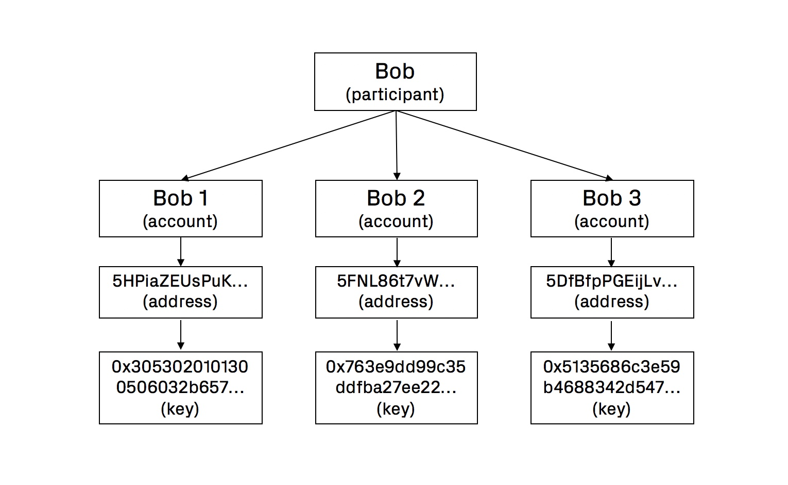

# Keys, Addresses and Accounts

### What Are Keys, Addresses and Accounts?

Accounts are the most basic representation of actor\(s\) on the platform. They are formally represented by unique human-readable addresses, which are themselves generated from their respective private keys. Each account can only be represented by one address, and a single key from which this address is derived.

Accounts are essentially anonymous as they have no identifying information intrinsically attached to them. For this reason their permissions within the governance hierarchy of the platform are strictly limited. Keys play the role of "signing" for accounts when some action is performed on the network.

An account is currently limited to three basic functions:

* Sending and receiving tJOY funds
* Functions relating to being a `Validator` \(see below\)
* Setting a memo for testnet compensation or some other defined purpose

### Creating and Managing Keys

Our current testnet allows participants to generate keys from a mnemonic or raw seed. Users can choose between two encryption systems for generating the key from the seed. These are `Edwards (ed25519)` and `Schnorrkel/Ristretto x25519 (sr25519)`.

`sr25519` is based on the same underlying Curve25519 as its EdDSA counterpart, `ed25519`. However, it uses Schnorr signatures instead of the EdDSA scheme. 

`sr25519` signatures bring some benefits over the ECDSA/EdDSA schemes. For example, Schnorr allows for native multisignature through signature aggregation while also being more efficient and retaining the same feature set and security assumptions.

If you would like to validate, the `session` key needs to use `ed25519` cryptography.

The private key, seed or mnemonic phrase should never be shared with anybody as these give access to your funds. 

### Account Balances

Participants should be aware that balances attached to addresses can be held in different states, including:

* **`available`**: funds that are available for any transaction.
* **`bonded`**: funds currently locked for validating or nominating
* **`unbonding`**: funds that are being unbonded \(will be redeemable after the bonding period has passed\)

### Memberships And Accounts

Memberships are a separate but linked concept to accounts \(keys\). While in some other contexts an account and membership might be referring the same thing \(in some web applications, for example\), in our testnets they must be understood as describing two distinct concepts.

 Read more about memberships [here](memberships/).

### Keys for Validators

Roles such as the `Validator` require users to manage a selection of keys \(accounts\), where each key is dedicated to a specific purpose. While in our Acropolis testnet only three keys were required to be a Validator, in Rome, five are needed.

#### `Stash Key`

The stash key is typically where a participant's wealth on the platform is stored. In most cases the stash key should only ever have to sign one message in order to assign the controller account. Once this is done, the controller account can act on behalf of the stash key.

#### `Controller Key`

The controller key acts on behalf of the stash key. It can perform actions with the "weight" of the stash key behind it.

#### `Session Key`

Session keys are specific to the validator role and have a variety of purposes linked to the activities of validators on the network. For Rome, two new session keys will be added.

You can read more about `validators` and their `session keys` in our handbook section dedicated to them.

