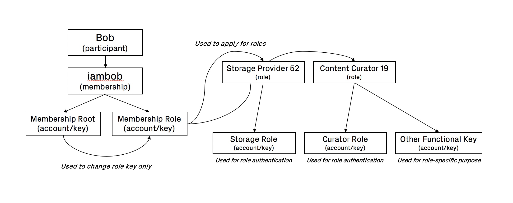

# Memberships

_Note: Memberships should not be confused with_ [_accounts_](../keys-and-addresses.md#what-are-keys-addresses-and-accounts)_, which are a much more basic structure on the platform._ 

### What Is A Membership?

A membership is essentially the consolidated representation of an actor's activities and resulting reputation on the platform. A membership is linked directly and indirectly to accounts \(keys\), each of which are used for specific purposes.

In past testnets, memberships were linked with just one root account \(key\) whereas in our Rome testnet, one membership can have multiple accounts \(keys\) directly and indirectly related to it.

Directly, memberships have an associated root key and a membership role key. The root key is used to change the role key only, and it is meant to be used extremely rarely. The membership role key is for authenticating as a member, for example when applying for a new role.

Indirectly, each role has at least one role key corresponding to that role \(which is always associated with a membership through the membership role key\). 

For example, the member Bob, who has the role of `Storage Provider` with `id=52` and `Content Curator` with `id=19` will have a separate role key for both of those. They are used as the primary means of authenticating in each role. These role keys are bound to that role during entry into \(application for\) the role. Beyond this, there may be other use case specific keys for each role, if required.

### Memberships And Reputation

Membership should be considered a valuable asset by platform actors. This is because by accumulating a positive reputation through performing helpful and responsible actions on the platform, a participant will earn greater rewards as a result of the increased likelihood of obtaining positions of greater responsibility within the platform's hierarchy.

For this reason it is encouraged for each testnet participant to maintain just one membership. While nothing technically prevents people from registering for multiple memberships, the value of doing a range of activities under one membership should be greater than having it fragmented, since reputation, in essence, increases with the length and scope of the history of consistent good conduct.

### Obtaining A Platform Membership

A platform membership can be obtained by registering for one. There is a small fee \(in tJOY\) associated with this to prevent spam registrations. This is currently `100 JOY`.

All of the memberships from the Acropolis testnet have been migrated across to the Rome testnet and given a starting balance \(at the genesis block\) of `2000 JOY`.  For this reason, participants in Acropolis will not need to register again.

### Membership Profile

Each member can set certain profile variables. The only "required" variable when registering is a `handle or nickname` which cannot currently be changed after registration. 

The Rome testnet also supports the setting of an `Avatar Image URL` and a short biography or description of a participant's testnet activities in the `About` section.

### Current Abilities Of Platform Members

A membership \(as compared with an account\) is currently able to do things such as:

* Stand as a candidate for council elections
* Vote in council elections
* Make proposals to be voted on by the council
* Upload multimedia content
* Edit multimedia content
* Make posts in the platform forum
* Create a channel

