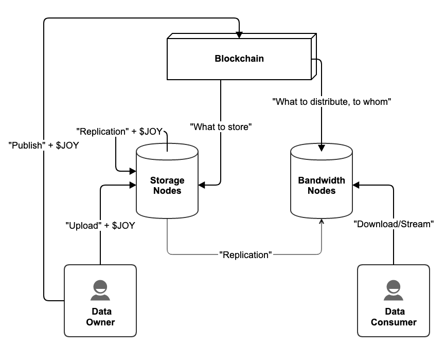

# Storage & Bandwidth

## Preamble

This subsystem is under active development, and this document attempts to both explain how the current production system (as of Giza) works, as well as give indications about what is expected to be added later before mainnet.

## Introduction

The network has a variety of static data assets used in different context. In the content directory, for example, there are avatars and cover images used for channels, and also preview thumbnail images for videos, as well as the video media itself, which may exist in multiple different resolutions and encodings for the same content. In the membership system images are used for the avatar of a user, and there is also a generalised storage capability. There is also a generalised storage service for the benefit of the council and each individidual working group, which are intended to be used for storing assets that are of use to actors occupying the given roles over time, or to the platform as a whole.

The purpose of the storage and bandwidth system is to provide the capability for appropriate actors to publish storage assets into the system for the purpose of long term archiving and at scale low-latency distribution of data to end users.

## Philosophy

There is an obvious first-principles question of why the network has these capabilities built in, in the sense that it directly finances and coordinates the provisioning of these services internally through its own administrative beuroracy, and using its own custom technolgy stack. Why can't the system just rely on AWS or some other similar offering?

Address custom tech stack separately from ecnomics!!!!!!!!!

Why not some other crypto offering? Arweage, Storj, ...

## Roles

There are two working groups involved in storage and bandwidth provisioning, one per subsystem. To learn more about working groups in general, please consult the [working-groups.md](../../governance/working-groups.md "mention") document. The roles are here tasked with the following, beyond the normal working groups activities inherent to each:

### Storage

* **Storage Lead: **Briefly stated, the lead manages
  * what set of storage providers should store what data.
  * what storage workers can actively participate as storage providers.
  * how different categories of data should be automatically stored once uploaded.
  * the size sensitive component of the upload price.
  * the replication factor on future uploads.
  * the upload blacklist.
  * whether uploads are globally allowed or not at any given time.
* **Storage Worker/Provider: **
  * Accepts and validates data uploaded from users for storage.
  * Replicates data initially stored with other storage providers.
  * Shares data with other storage providers and bandwidth providers.
  * Maintains public host resolution metadata.
  * Is incentivized by a mix of
    * user payment for uploads
    * probabilistic on-chain proof-of-storage challenges (not in Giza)
    * payment from peer providers & bandwidth providers when providing data (not in Giza)
    * slashing by discretion from group lead, with subsequent loss of reputational capital of membership in this role.
    * working group payments

### Bandwidth

* **Bandwidth Lead:**
  * what set of bandwidth providers should distribute what data.
  * what bandwidth providers can actively participate as providers.
  * how different categories of data should be automatically distributed.
  * policy metadata for groups 
* **Bandwidth Worker/Provider:**
  * Sends data to users on demand.
  * Replicates data from storage providers following local caching policy.
  * Maintains public host resolution metadata.
  * Is incentivized by a mix of
    * slashing by discretion from group lead, with subsequent loss of reputational capital of membership in this role.
    * payment from gateway providers (not in Giza)
    * working group payments

## Concepts

### Data Directory

An on-chain system which holds relevant state required to represent the data which is currently being stored, along with information about who owns it, how it is stored and how it is distributed. It also holds policy information about how to handle requests to introduce new data into the system. The node software that is operated by compliant storage and bandwidth providers uses this state as the ultimate source of truth for what they should be doing at any given time. There are a range of different extrinsic which facilitate updating the state of this system, such as uploading or deleting new data, or updating what a given provider should be doing.

For a detailed overview of how this system works, please review the [data-directory.md](data-directory.md "mention") document.

### Nodes

There are two distinct node type, storage nodes and bandwidth nodes, each being a network peer that the corresponding provider type operates in order to provision their service to the network. There is a reference software implementation of each node, called _Colossus_ and _Argus, respectively_, but in principle there could be alternative node implementations for the same underlying protocol described in document.

Storage nodes are primarily involved in

* accepting uploads from users,
* downloading data to be stored from other storage nodes, 
* uploading data to other storage nodes and bandwidth nodes that may require it,
* dropping data which is deleted from the network,

and bandwidth nodes are primarily involved in

* uploading data to users upon request,
* downloading data from storage providers in accordance with local caching policy,

There is no direct protocol level enforcement of what service-level agreement each node should conform to, for example in terms of

* storage capacity
* up-time
* up-speed
* down-speed
* connection capacity
* latency w.r.t. a given location

but each provider type faces a range of different incentives that aim to encourage them to comply with agreed upon standards out-of-band, in the working group. There exists on-chain information for resolving the, or a, host corresponding to the node of a given provider, and the provider is free to update this mapping as needed. There is also no protocol level awareness of what kind of underlying infrastructure is powering the node, but for the purposes of this documentation one can imagine it to be a single host serving the reference API in a way described by the protocol, and with a single canonical internal state and view of the data directory and blockchain.

For a detailed overview of how each node works, please review the [storage-node-colossus.md](storage-node-colossus.md "mention")and [distributor-node-argus.md](distributor-node-argus.md "mention") respectively.

### Service Game

WIP.

## Architecture

The key architectural properties of the system is as follows

* Distinct roles for storage and distributing data.
* Storage with redundancy and only partial replication in nodes, but no erasure coding on individual data.
* Bandwidth provisioning with flexible policy space, allowing for Content Delivery Network (CDN) like organization.
* The blockchain holds index of data, including ownership and metadata, and critical information about what service provider is obliged to perform storage and distribution for a given piece of data.
* When new data is added to the system, the blockchain has built in policies for deciding how storage and bandwidth services should be provisioned, but there is also room for manual intervention later to augment or change these initial determinations.

This can all be succinctly summarize in the following figure.

## Scenarios

### User Data Upload

WIP.

### New Storage Provider

WIP.

### New Bandwidth Provider

WIP.

### User Data Download

WIP.

### User Data Deletion

WIP.
